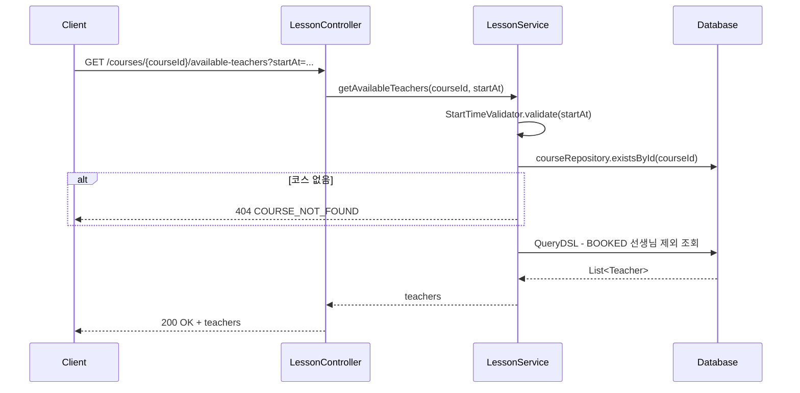
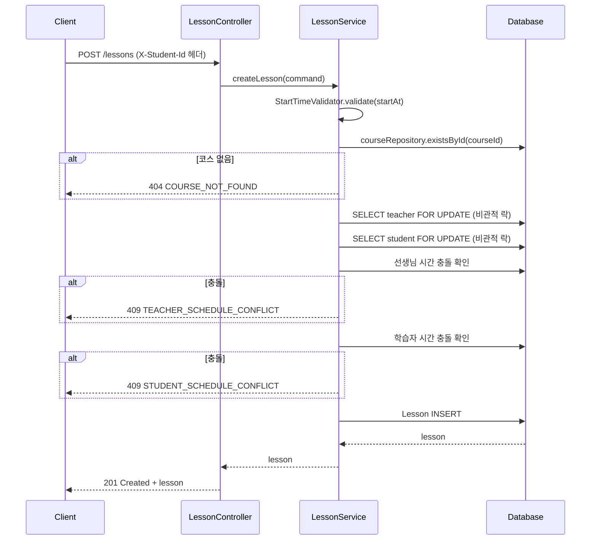

# Langdy Backend — 1:1 온라인 외국어 수업 예약 시스템

## 기술 스택

- Java 21, Spring Boot 3.4.3 — Kotlin보다 Java가 더 익숙하여 완성도를 우선하여 Java로 작성했습니다.
- Spring Data JPA + QueryDSL
- H2 (개발/테스트), MySQL (운영)
- Spock Framework (테스트)
- Gradle

---

## 실행 방법

```bash
# 빌드
./gradlew build

# 실행 (H2 인메모리 DB)
./gradlew bootRun

# 테스트
./gradlew test
```

H2 콘솔: http://localhost:8080/h2-console (JDBC URL: `jdbc:h2:mem:langdy`)

---

## 패키지 구조

```
com.langdy
├── controller/        # REST API 컨트롤러
├── service/           # 비즈니스 로직
├── repository/        # JPA Repository + QueryDSL
├── entity/            # JPA 엔티티, Enum
├── dto/               # 요청/응답 DTO, Command
├── exception/         # 예외 처리 (ErrorCode, GlobalExceptionHandler)
├── config/            # 설정 (Clock, QueryDSL)
└── util/              # 유틸리티 (StartTimeValidator, ResponseUtil)
```

---

## API 명세

### 공통 응답 구조

**성공**
```json
{
  "success": true,
  "data": { ... }
}
```

**에러**
```json
{
  "success": false,
  "code": "ERROR_CODE",
  "message": "에러 메시지"
}
```

---

### TASK #1 — 수업 가능한 선생님 목록 조회

```
GET /api/v1/courses/{courseId}/available-teachers?startAt={startAt}
```

**요청 파라미터**

| 이름 | 위치 | 타입 | 필수 | 설명 |
|------|------|------|------|------|
| courseId | path | Long | O | 코스 ID |
| startAt | query | LocalDateTime | O | 수업 시작 시각 (00분 또는 30분 단위) |

**응답 (200 OK)**
```json
{
  "success": true,
  "data": {
    "teachers": [
      { "id": 1, "name": "John" },
      { "id": 2, "name": "Sarah" }
    ]
  }
}
```

---

### TASK #2 — 수업 신청

```
POST /api/v1/lessons
Header: X-Student-Id: {studentId}
```

**요청 헤더**

| 이름 | 필수 | 설명 |
|------|------|------|
| X-Student-Id | O | 학습자 ID |

**요청 바디**
```json
{
  "startAt": "2026-03-10T09:00:00",
  "courseId": 1,
  "teacherId": 1
}
```

**응답 (201 Created)**
```json
{
  "success": true,
  "data": {
    "lessonId": 1,
    "courseId": 1,
    "teacherId": 1,
    "studentId": 5,
    "status": "BOOKED",
    "startAt": "2026-03-10T09:00:00",
    "endAt": "2026-03-10T09:20:00"
  }
}
```

---

### 에러 코드

| 코드 | HTTP 상태 | 메시지 |
|------|-----------|--------|
| INVALID_START_TIME | 400 | 유효하지 않은 수업 시작 시각입니다. |
| PAST_START_TIME | 400 | 과거 시각으로는 수업을 신청할 수 없습니다. |
| MISSING_STUDENT_ID | 400 | X-Student-Id 헤더가 누락되었습니다. |
| COURSE_NOT_FOUND | 404 | 코스를 찾을 수 없습니다. |
| TEACHER_NOT_FOUND | 404 | 선생님을 찾을 수 없습니다. |
| STUDENT_NOT_FOUND | 404 | 학습자를 찾을 수 없습니다. |
| TEACHER_SCHEDULE_CONFLICT | 409 | 해당 시간에 선생님의 수업이 이미 존재합니다. |
| STUDENT_SCHEDULE_CONFLICT | 409 | 해당 시간에 학습자의 수업이 이미 존재합니다. |

---

## API 시나리오 시퀀스 다이어그램

### 수업 가능한 선생님 조회



### 수업 신청



---

## 설계 결정

### courseId의 역할

과제 전제: **"모든 선생님이 모든 코스를 진행할 수 있다."**

`courseId`는 해당 코스가 존재하는지 확인하는 용도로만 사용되며, 선생님 필터링에는 관여하지 않는다. 수업 가능한 선생님 조회 API에서 `courseId`를 받지만, 실제 쿼리는 해당 시간대에 예약이 없는 모든 선생님을 반환한다. 향후 선생님별 코스 제한이 필요하면 `TeacherCourse` 매핑 테이블을 추가하여 확장할 수 있다.

### ID 기반 연관관계 (FK 대신 Long 필드)

`Lesson` 엔티티는 `@ManyToOne` 대신 `Long teacherId`, `Long studentId`, `Long courseId`를 사용한다.

- **N+1 방지:** 연관 엔티티를 즉시 로딩하지 않으므로 불필요한 쿼리가 발생하지 않는다.
- **도메인 결합도 최소화:** Lesson이 Teacher/Student/Course의 생명주기에 의존하지 않는다.
- **존재 검증:** 필요한 경우 애플리케이션 레벨에서 `existsById()` 또는 `findByIdWithLock()`으로 존재를 확인한다.

---

## 동시성 처리 전략

### 문제

같은 선생님, 같은 시간에 여러 학습자가 동시에 수업을 신청하면 중복 예약이 발생할 수 있다.

### 현재 구현: DB 비관적 락 (Teacher/Student 행 락)

```java
// TeacherRepository
@Lock(LockModeType.PESSIMISTIC_WRITE)
@Query("SELECT t FROM Teacher t WHERE t.id = :id")
Optional<Teacher> findByIdWithLock(@Param("id") Long id);
```

**핵심:** Lesson 행이 아닌 **Teacher/Student 행**에 락을 건다.

Lesson 행에 락을 걸면 첫 예약 시 row가 없어서 `SELECT FOR UPDATE`가 아무것도 잠그지 못한다. Teacher/Student 행은 항상 존재하므로 락이 반드시 잡힌다.

**동작 흐름:**
1. Teacher 행에 `PESSIMISTIC_WRITE` 락 획득
2. Student 행에 `PESSIMISTIC_WRITE` 락 획득
3. BOOKED 상태 충돌 확인 (락이 잡힌 상태이므로 안전)
4. Lesson INSERT
5. 트랜잭션 커밋 → 락 해제

**락 순서:** 항상 Teacher → Student 순서로 획득하여 데드락을 방지한다.

**트레이드오프:** Teacher 행 전체에 락을 걸기 때문에 같은 선생님의 **다른 시간대** 예약도 직렬화된다. 현재 규모에서는 문제가 없지만, 트래픽이 증가하면 유니크 제약 조건 `(teacher_id, start_at, status)` 기반으로 충돌을 감지하는 낙관적 방식이나, 시간대별 분산 락을 고려할 수 있다.

### 대안: Redis 분산 락 (Redisson)

```
Lock Key: lesson:teacher:{teacherId}:time:{startAt}
```

| 항목 | DB 비관적 락 (현재) | Redis 분산 락 |
|------|---------------------|---------------|
| 인프라 | DB만 필요 | Redis 추가 필요 |
| 성능 | DB 커넥션 점유 | DB 부하 분산 |
| 구현 복잡도 | 낮음 | 중간 |
| 적합한 규모 | 중소규모 | 대규모 트래픽 |

현재 규모에서는 DB 비관적 락으로 충분하며, 트래픽이 증가하면 Redis 분산 락으로 전환할 수 있다.

---

## 멀티 Pod 대응 전략

현재 동시성 처리는 **DB 레벨 락**에 기반하므로 Pod 수에 관계없이 동작한다.

```
[Pod A] ──┐
           ├──→ DB (SELECT ... FOR UPDATE) ──→ 하나만 성공
[Pod B] ──┘
```

### 향후 확장 방안

| 전략 | 설명 |
|------|------|
| **Redis 분산 락** | Redisson을 활용한 `Lock Key` 기반 동시성 제어. DB 부하를 줄이고 응답 속도 향상 |
| **예약 큐(Queue)** | 수업 신청 요청을 큐에 넣고 순차 처리. 대규모 트래픽에서 안정적이지만 응답 지연 발생 |

---

## 테스트

총 **29개** 테스트 (Spock Framework)

| 분류 | 파일 | 테스트 수 |
|------|------|-----------|
| 단위 | StartTimeValidatorSpec | 3 |
| 단위 | LessonServiceSpec | 10 |
| 통합 | AvailableTeachersControllerSpec | 6 |
| 통합 | CreateLessonControllerSpec | 9 |
| 동시성 | LessonConcurrencySpec | 1 |

### 동시성 테스트

10개 스레드가 동시에 같은 선생님, 같은 시간에 수업을 신청하여 **정확히 1건만 성공**하는 것을 검증한다.

```groovy
def "동시에 같은 선생님 같은 시간에 예약하면 하나만 성공한다"() {
    given:
    def threadCount = 10
    def executor = Executors.newFixedThreadPool(threadCount)
    def latch = new CountDownLatch(threadCount)
    def successCount = new AtomicInteger(0)

    when:
    (1..threadCount).each { i ->
        executor.submit({
            try {
                lessonService.createLesson(...)
                successCount.incrementAndGet()
            } catch (BusinessException e) {
                // TEACHER_SCHEDULE_CONFLICT
            } finally {
                latch.countDown()
            }
        })
    }
    latch.await()

    then:
    successCount.get() == 1
}
```
